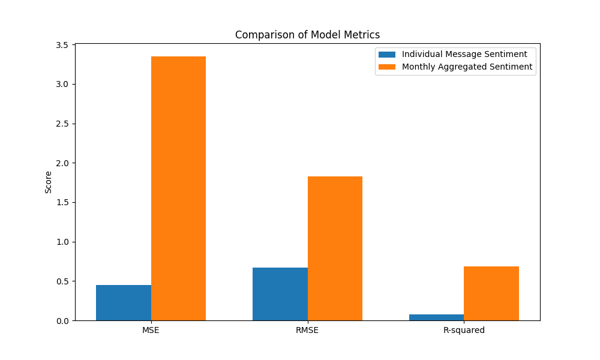

* **Project overview**
* **Setup and execution**
* **Findings (Top Positive/Negative Employees, Flight Risks, Insights)**
* **Visual references (images/figures from the report)**

---

# Employee Sentiment Analysis

This project analyzes employee communications (emails) to extract sentiment insights, rank employees by positivity/negativity, and flag potential flight risks. The goal is to support HR and leadership with actionable insights on workforce morale and engagement.

## Project Overview

* **Dataset:** 2191 emails (Subject, Body, Date, From)
* **Methods:**

  * Sentiment labeling with `distilbert-base-uncased-finetuned-sst-2-english`
  * Exploratory Data Analysis (EDA)
  * Monthly sentiment scoring (+1 positive, -1 negative, 0 neutral)
  * Ranking top 3 positive & negative employees monthly
  * Identifying **flight risks** (≥4 negative emails in 30 days)
  * Linear regression models (per-message and monthly aggregated) for predictive analysis

---

## Setup & Running the Code

### 1. Clone the Repository

```bash
git clone https://github.com/your-username/employee-sentiment-analysis.git
cd employee-sentiment-analysis
```

### 2. Create & Activate Virtual Environment

```bash
python -m venv venv
source venv/bin/activate  # Linux/Mac
venv\Scripts\activate     # Windows
```

### 3. Install Dependencies

```bash
pip install -r requirements.txt
```

### 4. Run the Notebook

Open Jupyter Notebook:

```bash
jupyter notebook employee_sentiment_analysis.ipynb
```

---

### Notes: You can use other platforms which support jupyter notebooks (Anaconda Jupyter, Google Colab, etc) to run the code in the notebook directly.

## Key Findings

### Top 3 Positive Employees (by monthly sentiment score)

* **2010 Example:** 
 
* **2011 Example:** 
 


### Top 3 Negative Employees

* **2010 Example:** 
 
* **2011 Example:** 
 


### Flight Risk Employees

Employees flagged as at-risk met the condition of **≥4 negative emails in any rolling 30-day window**.

* Several employees were identified under this rule (names withheld here for privacy).

*(Detailed list available in analysis output)*

---

## Insights & Recommendations

1. **High Negative Sentiment**: Over half of messages were negative (1191 vs. 1000 positive, none neutral). Indicates systemic communication stress.
2. **Flight Risk**: Repeated negative senders represent attrition risks—proactive HR engagement is advised.
3. **Predictive Modeling**:

   * Linear regression performed poorly (low R², systematic errors).
   * Future work: try classification models (e.g., logistic regression, random forest, or LLM fine-tuning).
4. **Topic Monitoring**: Negative emails often reference "Master Power Contracts" and generic "Re:" subjects—HR may investigate specific business issues driving dissatisfaction.
5. **Leadership Opportunity**: Recognize & reward top positive communicators to reinforce morale.

---

## Visuals

* **Sentiment Distribution:** 
 
* **Top 10 Frequent Senders:** 
 
* **Predictive Model Performance:** 
 

*(All visuals are in the visualizations folder)*

---

## Future Plans

* Finish the automate dataset downloading process.
* Integrate classification models for better prediction.
* Automate flight risk alerts in real-time dashboards.
* Extend analysis with organizational metadata (roles, departments).

---

